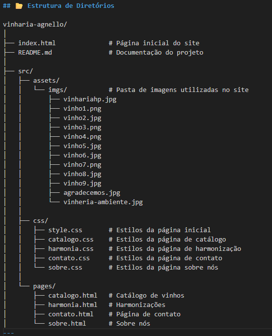

# 🍷 E-commerce Vinheria Agnello – Site Estático (HTML/CSS)

## 📖 Descrição do Projeto
Este repositório contém a primeira versão navegável do site da **Vinheria Agnello**, desenvolvido como projeto acadêmico com **HTML5 e CSS3**.  
O trabalho é inspirado no caso fictício **“O Caso da Vinheria Agnello”**, referência das disciplinas do 1º ano de Engenharia de Software.

A **Vinheria Agnello** é uma empresa familiar de São Paulo, com mais de 15 anos de atuação no mercado de vinhos. Seu principal diferencial está no **atendimento consultivo**, em que os vendedores orientam os clientes sobre tipos de uvas, regiões produtoras, vinícolas, rótulos e harmonizações com diferentes pratos.  

Com a pandemia, o movimento da loja física foi fortemente impactado. Incentivado por sua filha **Bianca (Product Owner no caso)**, o proprietário Giulio decidiu investir na criação de um portal digital para traduzir a experiência calorosa da loja física para o ambiente online, sem perder a essência do atendimento humano e personalizado.  

Este site é um protótipo acadêmico que simula essa transição para o digital, com foco em **usabilidade**, **identidade visual consistente** e **conteúdo institucional**.

---

## 👨‍💻 Integrante
- **Gabriel Ardito**

---

## Site publicado
Acesse o site no GitHub Pages: https://gabriel-ardito.github.io/Vinheria-Agnello/

---

## 📂 Estrutura de Diretórios

---

## 🧭 Menu de Navegação
Todas as páginas compartilham o mesmo **menu superior** e o **rodapé**, garantindo consistência de navegação e identidade visual:
- Início
- Catálogo
- Harmonizações
- Contato
- Sobre nós

---

## 📂 Estrutura do Projeto
O site é multipágina, leve e sem dependências de build. Basta abrir o arquivo `index.html` em qualquer navegador.  
As páginas são:

- **`index.html` (Início)**  
  Página principal com imagem de destaque (hero image), breve apresentação da vinheria, destaques de produtos e depoimentos de clientes.

- **`catalogo.html` (Catálogo de Vinhos)**  
  Mostra os vinhos disponíveis divididos em três categorias: tintos, rosés e brancos, cada um com imagens e descrições.

- **`harmonia.html` (Harmonizações)**  
  Explica como harmonizar vinhos com diferentes tipos de pratos, acompanhada de uma tabela prática de combinações.

- **`contato.html` (Entre em contato)**  
  Formulário para envio de nome, e-mail e mensagem, simulando o canal de atendimento ao cliente.

- **`sobre.html` (Sobre nós)**  
  Página institucional com a história da Vinheria Agnello, seus diferenciais e valores. Inclui uma imagem do ambiente físico e um vídeo incorporado do YouTube.

Cada página possui seu próprio arquivo CSS em `src/css/`, todos utilizando a mesma identidade visual.

---

## ⚙️ Como Executar Localmente
1. Clone ou baixe este repositório.  
   git clone <url-do-repositorio>
2. Abra o arquivo `index.html` diretamente em seu navegador.  
3. (Opcional) Para uma melhor experiência de desenvolvimento, use a extensão **Live Server** no VS Code para recarregamento automático.  
4. Verifique os caminhos das imagens na pasta `src/assets/imgs/` (já configurados nos arquivos HTML).

---

## 🎨 Identidade Visual
A paleta de cores escolhida reforça a sofisticação do mundo do vinho:  
- **#9a3f3f** – Vinho escuro (menu e rodapé)  
- **#c1856d** – Tom médio (detalhes e botões)  
- **#e6cfa9** – Bege claro (caixas de conteúdo)  
- **#fbf9d1** – Bege suave (plano de fundo)  

A tipografia utilizada é **Arial**, garantindo simplicidade e boa legibilidade.

---

## 💻 Tecnologias Utilizadas
- **HTML5 semântico**: estrutura de páginas com tags modernas (`header`, `main`, `section`, `footer`, etc.).  
- **CSS3 customizado**: estilização modular, com arquivos separados para cada página.  
- **Flexbox**: utilizado para alinhar menus, imagens e seções.  
- **Design responsivo inicial**: imagens adaptáveis à largura da tela.  

---

## 📌 Observações
- Este projeto é **estritamente acadêmico** e não possui funcionalidades dinâmicas ou integração real com banco de dados.  
- Todos os dados de clientes e mensagens no formulário são apenas **exemplificativos**.  
- O foco do trabalho foi aplicar boas práticas de **semântica HTML** e **estilização com CSS desacoplado**.  
- O projeto pode servir como base para evolução futura em **JavaScript** ou integração com sistemas de e-commerce reais.

---
